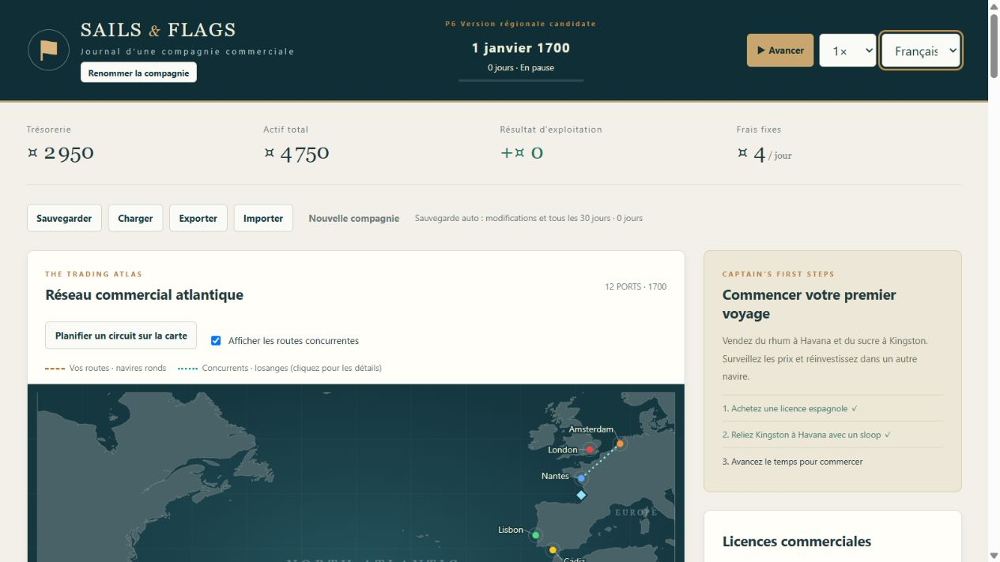
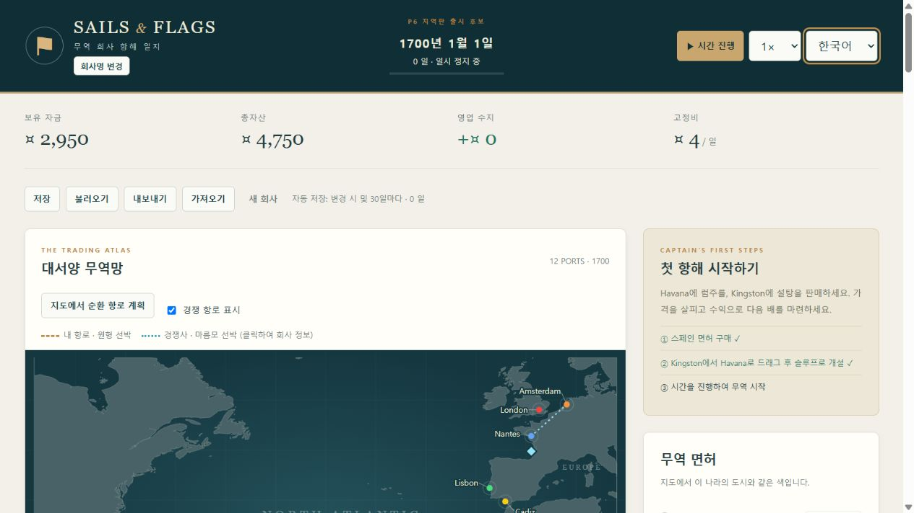

# P6 地域限定リリース候補 作業記録

2026-10-01 / 0.7.2 → 1.0.0-rc.1。ユーザー依頼「次の開発フェーズ」に基づき、ImplementationPlanのP6を実施。GitHubへのpushは行っていない。

## 実装と判断

- 中国語は簡体字zh-CNを採用。既存日英に簡体字・韓国語・フランス語・スペイン語を追加。会社・船の別名は翻訳しない。都市のmapNameも保持。
- 既存t/txを維持し、英語原文を検索キーとして4言語の配列を同梱。原文を変更したらカタログも変更する。既存分を含む**442ソース文言**の網羅性をテストする。国・商品・船型、生成設計名、動的開設文言も別途検査。
- 年次復元と市場・会計検証を含む、通常初期資金の3シード×50年シナリオを追加。各システムを有効にしただけでなく、実際の研究・建造・都市投資・拡大と戦争・襲撃の発生をassertする。
- 最初は拡大閾値25%で試走したが、設計船を追加したルートで増船が発生せず「拡大を実際に通す」という試験条件を満たさなかった。試験戦略を5%に変更して、拡大・縮小・再配置・損失補充を通した。ゲームの既定閾値や経済式は変更していない。
- 「保全保存（P6）」は既存の有効スロットから最も経過日数の大きい元JSONを一度だけ保管。保存本体更新より前に実行し、失敗時は本体を維持。通常世代バックアップとは独立。古い別会社を選ぶ可能性はガイドに明記。
- 新規利用時に保存がまだなければ保全は作らず、後の保存更新時に最初の正常保存を保全。保全領域が空文字や破損でも上書きしない。空文字も破損として一覧に表示するよう改善。

## 発見・修正

1. **最大規模でSVG航路線が重複して描画負荷が高い**：200の3港巡回で600本の自社線を描いていた。無向区間・運航状態・選択状態ごとに共有し、選択線を最前面に描く。200個の個船マーカーと競合のクリック対象は保持。シミュレーションデータには変更なし。
2. **言語選択のアクセシビリティラベルが旧言語のまま**：時間操作部のDOMを維持する処理でaria-label更新が抜けていた。言語切替時に更新。
3. **言語を変更しても直前の通知が旧言語で残る**：切替時に一時通知とタイマーをクリア。継続表示の世界・被害通知は通常の再描画で翻訳される。
4. **新規会社設立でも「保存を読み込みました」と通知する**：復元と新規設立で通知を分離。韓国語の新規設立通知と、切替後の通知消去を実画面で確認。

## 検証結果

`npm test`：135件成功、0失敗、約29.25秒。生ログ：[p6-test-results.txt](p6-test-results.txt)。翻訳、会計・保存、旧v1～v5移行、設計・船団、P6統合を含む。

| シード | 経過日数 | 終了現金 | 総資産 | 開戦 / 終戦 | 襲撃 / 喪失船 | 自動購入拡大 / 縮小 / 補充 |
| --- | ---: | ---: | ---: | --- | --- | --- |
| 1 | 18,250 | 219,840.50 | 252,296.34 | 20 / 19 | 151 / 1 | 13 / 230 / 1 |
| 42 | 18,250 | 188,912.57 | 221,457.67 | 22 / 20 | 140 / 2 | 12 / 79 / 2 |
| 1700 | 18,250 | 326,484.36 | 358,717.30 | 18 / 18 | 154 / 2 | 13 / 151 / 2 |

各シードで50回の年次保存から次の日の完全一致。破産なし・両競合存続。詳細：[p6-campaign-results.json](p6-campaign-results.json)。この単一路線戦略では資産1位を達成しなかった。1位後の継続、破産停止、復旧は資金を調整した別の境界テストで検証し、自然な全プレイ経路のバランス保証とは区別する。

### 性能

基準端末：Windows / AMD Ryzen AI 5 PRO 340 / Radeon 840M / 12論理CPU / OS報告約28GiB / Node 24.15.0。内蔵ブラウザUAはChrome 154、表示1280×720。CIMによる端末情報の取得は権限で拒否されたため、Nodeのos標準APIでCPU・メモリだけを取得した。

- Node、200隻・200航路×365日：日次p95 **5.224ms**、最大125.664ms、保存生成＋検証13.386ms、438,684バイト。[計測値](p6-scale-results.json)
- ブラウザ、地図＋選択中航路の16倍速10秒計測：改善前フレームp95 **133.3ms**、改善後 **16.8ms**。改善後の日次計算＋DOM更新p95 **13.7ms**、最大127.5ms。10秒で160日、測定中非表示なし。[改善前](p6-browser-scale-before.json) / [改善後](p6-browser-scale-after.json)
- 実アプリでは別ポートの検証専用保存をインポートし、200隻・200航路を16倍速で863日まで運行。通常保存復元後も200隻・200航路。さらに、新規状態を保存した後に「保全保存（P6）」から863日目・200隻へ戻れることを確認。ブラウザの警告・例外ログなし。
- 統計は単一端末の測定結果。コンポーネント用計測を実アプリ全体のFPSと呼ばない。初回描画・GC等の最大遅延は残る。

### 6言語の画面

独立オリジン `127.0.0.1:4185` で、各言語の免許取得→新規航線開設（在庫がない船の自動購入）→保存→手動保存選択→復元確認を実操作。1隻・1航路、残金2,950で復元。既存ユーザーの `4176` の保存・タブは触れていない。

- 中国語・韓国語の文字、フランス語の長文、ロケール別日付・桁区切りを確認。
- カスタム名のエスケープ、都市固有名、言語変更による状態不変は自動検査。
- ブラウザの390px幅指定は設定呼出し後も実際のdocument幅1265pxのまま。再読込・新規検証タブでも反映しなかったため設定を解除し、狭幅試験は未完了と明記。
- 翻訳は実装時の翻訳であり、ネイティブ話者レビューは未実施。

## 引継ぎ

Architecture.md、ExternalLibrary.md、ImplementationNote.md、README、実装計画を更新し、Documents/ReleaseGuide.mdに更新・復旧・検証とサポート範囲を記載。ライブラリやフォントの外部依存追加なし。

正式版までの残項目：外部ブラウザ、狭幅表示、人による翻訳と初見操作（収支・襲撃・免許取消理由の説明）のレビュー。次のゲーム機能フェーズはP7陸上交易だが、今回はP6リリース候補まで。

終了時に検証用ポート4185と検証タブを停止。確認用4176はHTTP 200で、P6のソースを配信していることを確認した。
