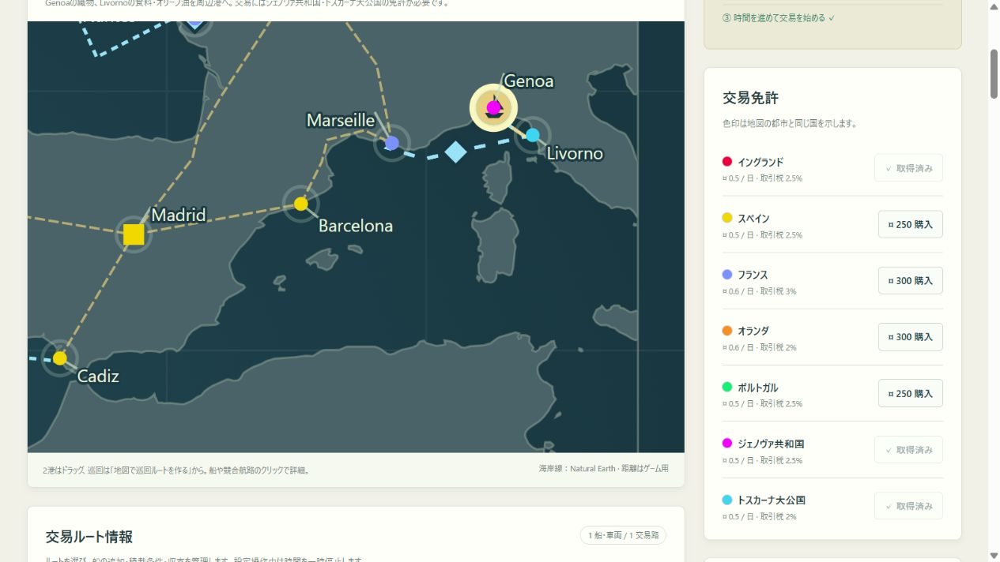

# P8 第1地域：西地中海への拡張

日付：2026-10-02。main上の2.0.0-alpha.1 / 保存v10。ユーザーの「次の実装フェーズ」の依頼に基づく。1.1.0ブランチは変更しない。今回の開発ではコミット・pushを行っていない。

## 選定と範囲

現行ImplementationPlanのP8は世界の段階的拡張。既存のBarcelona・Marseilleへ接続できるGenoa・Livornoを最初の組として選択した。両者は異なる政治主体・交易機能を持つ港であり、国別の道路数合わせのための都市配置ではない。内陸都市・道路は増やさず、北アフリカ・東地中海・世界全域・キャラバンは後続へ残す。

歴史的背景の確認（2026-10-02参照）：

- [Genoa市の公式観光案内](https://www.visitgenoa.it/sites/default/files/2024-02/Pocket%20guide%20to%20Genoa_0.pdf)：海港、交易・金融活動、ジェノヴァ共和国の背景。都市の採用根拠に使用。
- [トスカーナ州公式観光案内：Livorno](https://www.visittuscany.com/en/towns-and-villages/livorno/)：Mediciの商業政策による港の発展を確認。
- [Livorno国立公文書館：1593年のLivornine](https://archiviodistatolivorno.cultura.gov.it/archivio-notizie/notizia?cHash=250c3763b718e8d4c3fda67bf24263a0&tx_news_pi1%5Baction%5D=detail&tx_news_pi1%5Bcontroller%5D=News&tx_news_pi1%5Bnews%5D=61)：トスカーナ大公による商人受入政策の背景を確認。

市場数値・免許価格・外交基準は史実の統計ではなくゲーム用。Genoaの織物は絹製品等を集約し、Livornoの供給はトスカーナの後背地を含む。税率はプレイ用の共通ルールであり歴史的な自由港制度の厳密な再現ではない。

## 実装

17港＋2内陸都市、7国家、10品目。新国の色はジェノヴァが紫、トスカーナがシアンで既存5国と区別。オリーブ油は地中海側に供給、北欧州・カリブ側に需要。Ligurian CompanyはGenoa–Livornoから営業し、共通市場・価格・月次AI・買収・権利移管を使う。外交基準港と競合ID上限をデータ定義から参照するよう変更。

既存港同士105組の海路は凍結v9ルータへ委譲して完全維持。新港の31組を追加し、合計136組について独立した海岸線サンプリング検証を実施。Marseille–Genoa 220nm、Genoa–Livorno 90nm、Livorno–Barcelona 387nm。新港と北大西洋の接続でもGibraltarを経由する。

## 発見と修正

- 国家間関係が10組、競合所有者がcompany-1/2に固定されていた。国家数から組数を計算し、競合開始データを共通化。買収・道路／都市権の検証にも反映。
- 新品目・国家を現行データへ直接追加すると旧検証が失敗するため、v9エンジン・依存を凍結。旧保存を先に検証してから追加型で移行する。旧会社の設定を再初期化しない。
- 海上経由点の追加は既存港間の最短経路も変え得るため、既存105組を明示的に維持。出港中の航海や距離見直し停止の状態を変更しない。
- 地図の新拡大範囲では当初ラベル・マーカーが大きすぎた。欧州拡大と共通の縮小スタイルを適用し、Genoa / Livorno / Marseille等のラベル位置を調整。
- 過去の回帰テストは固定の都市・国家・品目・競合数、保存v9、旧市場全体一致を仮定していた。新しい規模へ期待値を更新し、移行テストは旧全品目・旧国家値の完全一致を維持したうえで追加分を別検証。

## 保存互換性

v10専用スロット、旧v9以下と海路修正前保全を維持、新保全p8-ligurianを初回だけ作成。既存会社の現金・積荷・航海・船・航路・投資・積載許可・乱数・旧外交値は不変。オリーブ油の積載は旧ルートで勝手に許可せず、利用者が追加する。

新競合は移行日の会社として参入し、時間・会計日・月次判断・出港時刻を同期。移行は旧版からだけ行うためv10復元で再参入しない。旧データの破損は追加前に拒否し、保存保全に失敗した場合も元の本体を上書きしない。旧版への逆移行は対象外。

## 検証結果

- node --test：165件成功、失敗0、74.77秒。[生の結果](p8-test-results.txt)。追加地域専用7件：定義と距離、旧全状態保持、破損拒否と保存・再参入防止、買収と没収、外交組、6言語、新地域長期運航。
- 既存の通常資金・3シード×50年統合試験も全成功。世界・経済・襲撃・投資・自動化・年次復元を継続検証。
- 新地域の通常資金5,000・3シード×10年：Genoa→Livorno→Marseilleから開始し、資金が15,000を超えた後Livorno–Londonへ展開。免許・船・自動管理・外交投資は実APIを使用。年次復元と次の1日がライブ状態と一致、オリーブ油売却、両航路の多数の到着、現金会計を確認。終了現金はseed1=316,109.73、42=282,410.92、1700=343,168.03。これは当該自動戦略の結果で利益保証ではない。
- 200隻・200航路・365日：[計測結果](p8-scale-results.json)。日次p95 14.22ms、最大224.96ms、保存43.43ms、547,733 bytes。全テストと同時に計測。p95≤50ms・保存≤1秒の基準に適合。
- 独立した4189ポート・内蔵Chromiumで免許取得、地図の都市名クリックからGenoa–Livorno開設（購入額1,800／開設後2,640表示）、16倍速144日、保存・再読込を操作。現金8,349.6・日数144の一致を確認。6言語切替も確認し、console警告・エラーなし。
- 検証ポートに残っていた前回のv9フィクスチャも実UIから復元し、現金100,842.4／1日／旧航続不足の停止を保って新地域・新競合が加わることを確認。利用者の4176タブ・保存には触れていない。

外部Chrome/Edge/Firefox/Safari、狭幅実機、人による翻訳・初見プレイ評価は未実施。P8全世界版の完成や正式公開ではなく、次地域への拡張可能な最初のプレイ可能版。
