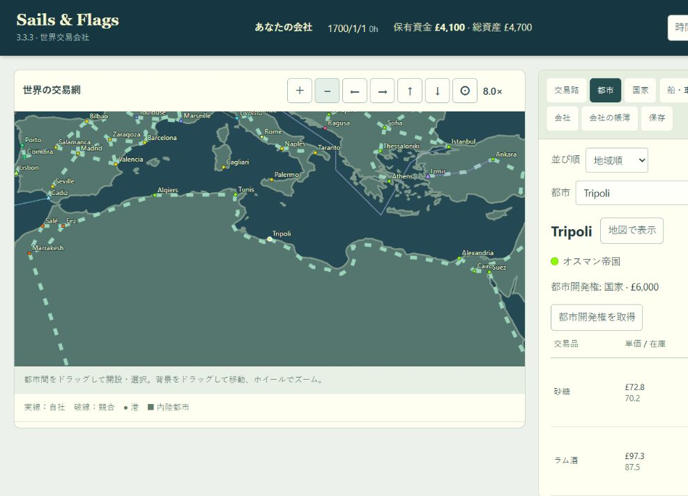
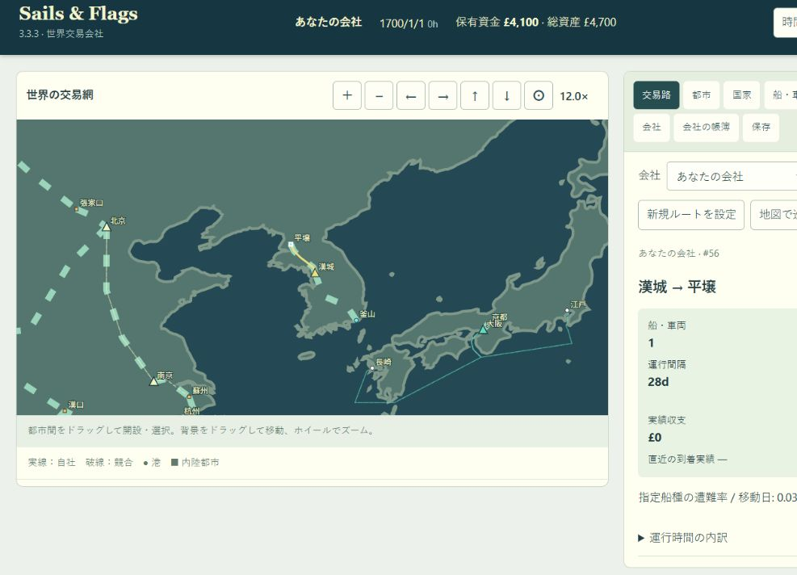

# 沿岸陸路の修正・平壌追加

## 沿岸陸路の表示修正・平壌追加（2026-10-06）

Bilbao―Bordeaux、Thessaloniki―Athens、Alexandria―Tripoli、Tripoli―Tunis、Luanda―Benguela、Mérida―Veracruz、Caracas―Cartagena、St. Augustine―Charleston、Accra―Benin Cityの9陸路に、湾・海・湖を避ける経由点を追加しました。道路線・交易ルート線・車両移動は同じ修正経路を使います。既存の距離・地形・所要時間・必要免許・道路権は維持します。

Luandaは簡略海岸線の海側に点があったため、表示だけを東へ約0.12度（SVG上0.3）移動しました。地理座標・海路距離は変えません。

平壌を朝鮮所属の内陸都市として末尾へ追加し、漢城―平壌の260kmの陸路を設置。主産品は食料・織物で、都市表記は平壌とします。世界228都市（123港・105内陸都市）・39国家・216有効陸路。旧セーブには市場・都市開発・道路を1件ずつ追加し、既存の運行・所有・会計・乱数を保持します。

## 発見と対応

- 海岸に沿う経由点がないため、直線が湾・海を横切っていた。Caracas―Cartagenaはマラカイボ湖の南を迂回させる。
- Luandaは元座標が簡略ポリゴンの外にある。経緯度を変えず表示用座標だけを陸側に移す。
- 手動の経由点だけではシドラ湾・エジプトの沿岸湖・Benguela北岸・Veracruz近郊・Charleston南岸で水面を横切る候補が残った。landSegmentによる線分と海岸/湖岸の交差検証により追加調整した。
- 平壌を古いINLAND配列へ追加すると既存都市の番号がずれるため、他の拡張都市と同様にCITIESの末尾へ追加する。旧都市番号・道路番号は変えない。
- 既存道路の距離・地形・免許を維持し、車両のゲーム内所要時間は変えない。線の表示と移動位置だけ修正する。

## 平壌の設定

[GeoNamesの平壌座標](https://www.geonames.org/search.html?country=KP&q=Pchjongjang)を参考に125.75E/39.03Nを使用。国は既存の朝鮮（joseon）に揃える。食料・織物と260kmの丘陵路はゲーム用の設定であり、史料の生産統計や道路復元ではない。

## 検証

- 追加4件＋Wasm境界3件の7テストに成功。9陸路は両方向・各線分・移動中の補間点を検証。平壌の需要、生産、都市間隔、陸路での交易と保存を検証。
- 変更前の実3.3.3セーブ（対象9陸路を開設して9日進行）を移行し、追加部分以外は保存内容が完全一致。さらに31日進行・再読込に成功。
- 既存227都市の番号・実座標・市場定義、全海路距離、既存224道路スロットの距離・地形・免許・治安が不変であることを旧世界データと比較。表示情報の変更はLuandaのみ。
- 外部ライブラリの追加なし。
- 関連回帰テスト28件も成功（旧都市構成0～8の移行、旧会社構成、都市の表示間隔、海路・陸路接続、海上経路維持）。追加・境界テストと合わせて35件成功。前版で成功した全85件のうち対象外の長期運転等は今回再実行していない。
- ブラウザで平壌の都市画面、漢城→平壌のドラッグ、260kmの見積り、朝鮮免許取得、馬車による開設を確認。修正9区間と新設1区間のSVG経路を出力データと照合し、全10区間が一致。
- 地中海沿岸の迂回経路を目視確認。ブラウザ警告・エラーなし。独立した4209番ポートの検証タブ・サーバーは終了し、ユーザーの4176番ポート・保存内容には触れていない。
- git diff --checkと変更JSの構文検査に成功。

