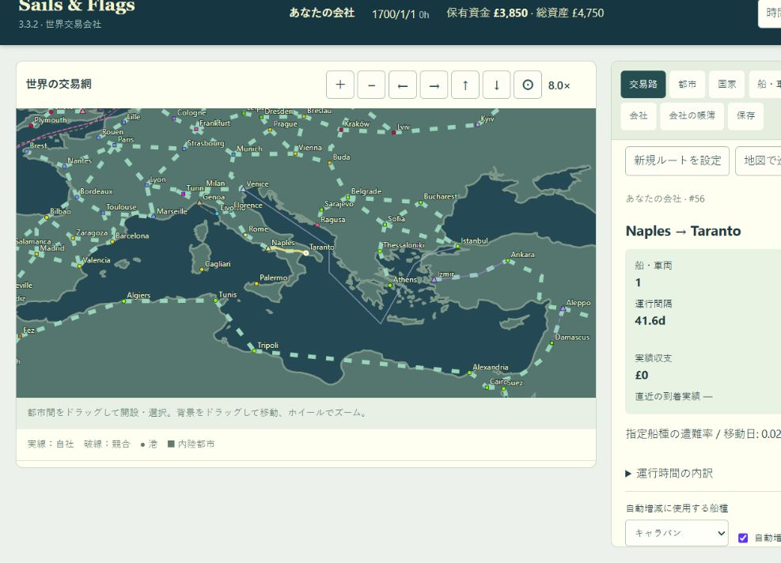

# 陸路整理・Taranto追加（2026-10-06）

## 陸路整理とTaranto追加（2026-10-06）

Lima―Quito、Lima―Arequipa、Lisbon―Porto、Porto―Madrid、Cadiz―Madrid、Madrid―Barcelona、Nantes―Lyon、Paris―Frankfurt、Madrid―Parisの直接陸路9区間を廃止しました。Madrid―Bordeauxの直接道路は元からありません。港同士の海上交易には影響しません。

Valencia―Barcelona（350km）、Madrid―Bilbao（400km）、Naples―Taranto（310km）を新設。距離・地形はゲーム用の概算です。TarantoはNaplesと同じスペイン所属の港とし、食料・オリーブ油を主産品とします。世界227都市（123港・104内陸都市）・39国家・利用可能な陸路215区間。

旧セーブの廃止区間を含む運行ルートは解除し、全配置車両を未使用へ戻します。残存貨物の原価、道路取得額、未受取道路収入を所有会社に返金し、道路の日額投資を終了します。その他の既存ルート・道路権・市場・乱数は維持します。

## 実装上の注意

- 保存は道路を配列番号で持つため、単純な削除で後続道路の所有権・投資をずらさないよう、廃止9スロットを予約位置として残す。現行の経路検索・地図・購入・投資・道路権表示からは除外。
- 旧版データは廃止対象を含めて検証した後で変換。不正貨物を削除して検証をすり抜けることがないようにする。
- 荷役・移動・待機中いずれも車両を保全。既に販売済みの商品は補償せず、保存時点の残存貨物の原価だけを返金する。道路の整備費など過去に消費した費用は返金しない。
- 取得額・未受取収入・原価の返金は全社に適用し、帳簿に専用項目を記録。プレイヤーには移行通知を表示。
- 検証中、競合の保有免許を上書きした試験データが既存ルートの免許条件を満たさず拒否された。試験データでは既存免許を保持して必要国を追加するよう修正。
- city_version 7は道路改訂、8はTaranto追加。元の3.3.2以降の旧都市構成を保持して移行できるようにする。

## Taranto設定の出典と設計判断

座標は[Taranto港湾当局の案内](https://www.port.taranto.it/index.php/en/user-services/11-il-porto/60-general-information)の北緯40度27分・東経17度12分を使用。国は既存Naplesと整合させたゲーム内のスペイン。主産品・310kmの陸路・地形はゲーム用設定であり史料の生産統計ではない。海路は外洋網の[19,39]に単一接続し、旧港間の経路を維持する。

## 検証

- Wasm再ビルド、追加7件とWasm境界3件の計10件が成功。
- 変更前のWasmで作った実セーブ13件（待機・積込・移動状態）を現版へ読み込み。車両保持・原価/道路取得額/未受取収入の返金・31日進行・再保存を確認。
- Taranto追加前の世界データとの比較で、既存226都市の全情報と旧港間の距離行列が完全一致。
- ブラウザの独立した4209番ポートでTarantoの市場・位置、Naples→Tarantoのドラッグ、スペイン免許取得、キャラバン1台によるルート開設を確認。地図道路と道路権一覧は215件、新設3件が表示され、廃止9件は非表示。ブラウザ警告・エラーなし。
- 旧い回帰テストが予約済みの廃止道路も通行可能と期待していたため、現行の利用可能道路のみを検査し、廃止区間の拒否は専用テストで検査するように更新。
- ExternalLibrary.mdに追加する依存ライブラリなし。検証用タブ・サーバーは終了し、ユーザーの4176番ポートとセーブは変更しない。
- 全体回帰テスト `npm test`: 85件すべて成功（約542秒）。50年間の会社シミュレーション、旧都市・旧会社構成の移行、船/車両・技術・外交・会計・保存を含む。`git diff --check`と変更JSの構文検査も成功。

