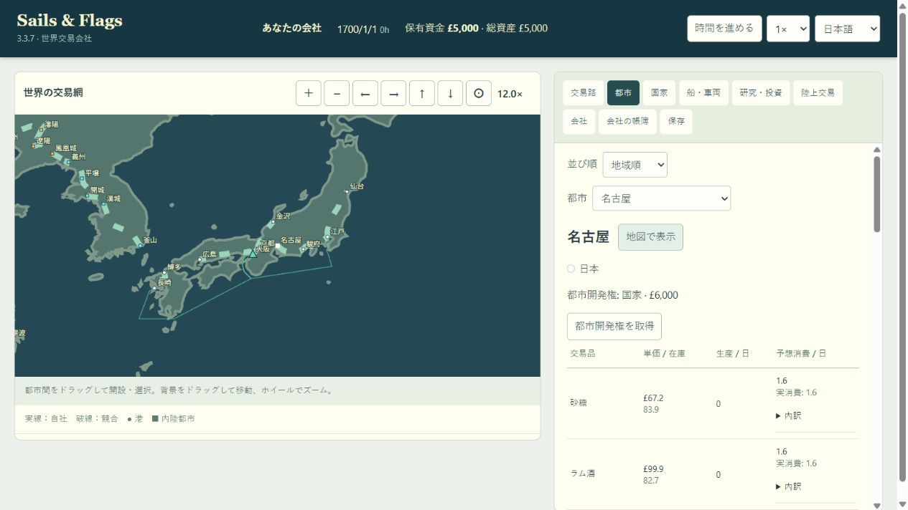

# 日本の6都市と街道

## 実装範囲

過密化を避けるというユーザーの方針に従い、追加は合意した6都市に限定しました。日本は10都市、世界289都市（131港・158内陸都市）、48国家・20品目・321道路スロット（有効303・廃止18）です。公開バージョンは3.3.7のまま、内部city_versionは17です。

| 都市 | 種別 | 主産品のゲーム設定 |
|---|---|---|
| 名古屋 | 内陸 | 織物・陶磁器 |
| 駿府 | 内陸 | 茶・木材 |
| 広島 | 港 | 食料・木材 |
| 博多 | 港 | 織物・食料 |
| 金沢 | 内陸 | 絹・工具 |
| 仙台 | 内陸 | 食料・木材 |

都市の市場は周辺産地を含む近似です。東アジアの需要と既存の生産適性を利用し、全品目への需要を維持します。国籍・免許は日本へ統一し、藩別免許や歴史イベントは追加しません。名古屋の海上取引は今回は実装せず、城下の内陸市場として扱います。

| 追加街道 | 概算距離km | 地形 |
|---|---:|---|
| 京都―名古屋 | 170 | 丘陵 |
| 名古屋―駿府 | 185 | 丘陵 |
| 駿府―江戸 | 180 | 山岳 |
| 大阪―広島 | 350 | 丘陵 |
| 博多―長崎 | 165 | 丘陵 |
| 京都―金沢 | 250 | 山岳 |
| 江戸―仙台 | 370 | 丘陵 |

京都―江戸の直通道路は作らず、名古屋・駿府で中継します。東海道の七里の渡しは海路のため、京都―名古屋は美濃・関ヶ原方面を回る陸路へ近似しました。箱根・浜松・岡崎・姫路・岡山・宇都宮・福島などは経由点で表現し、取引・荷役・追加の停車を発生させません。街道名に対応する史実の全宿場・正確な線形の復元ではありません。

## 地形・保存・既存データ

- src/japan-expansion-data.jsに定義を集約し、都市と道路を末尾へ追加。ゲーム処理と状態管理は引き続きWasmが担当します。
- 近接都市の最小表示間隔をSantiago de Chile―Valparaíso基準で検証。博多は長崎との表示間隔確保のため表示だけを補正し、実座標は保持しています。
- 初回の地形検査では駿府東方と大村湾付近の道路、広島の港外経路、博多の海洋網接続に水陸の交差を検出。道路は山側/湾東側へ補正し、広島は豊後水道側の水域を経由する接近経路、博多は水域のみを通る海洋網接続へ修正しました。陸地・水域判定を緩和していません。
- 広島・博多は海洋網に各1本で接続。全既存港間の距離と形状を保持し、日本商人の初期航路も変更しません。港の市街地から最初の海上点までの短い接近部分は、従来の港と同様に抽象化しています。
- 旧16は283都市・314道路として検証し、新市場・都市開発・道路権だけを追加。既存保存の会社・運行・市場・投資・外交・乱数は保持します。旧15以前の移行と平壌―漢城の廃止処理も維持します。
- 外部ライブラリ・素材の追加なし。ExternalLibrary.mdの依存関係一覧に変更はありません。

## 検証

- Wasm再ビルド成功。
- japan-expansion / manchuria-korea / indochina / wasm-boundaryの15テスト、失敗0。
- 全6都市の所属・市場・陸地上の表示間隔、全7街道の表示補正後の陸地性・往復形状を検証。
- 博多・広島の海上接近経路と海洋網への接続を水域判定。両港から全港への到達・距離・往復対称性・使用する全沖合線分の水域性を検証。
- 新7陸路と新2港の長崎航路を744日進行し、9ルートすべてで配送成立。日本免許不足の拒否、道路投資、競合の50ルート上限、保存再読込の完全一致を確認。
- 旧16の配列・全既存保存項目の保全と、未来版/欠損配列の読込拒否を検証。前回の平壌―漢城の廃止・返金試験も成功。
- 変更直前の実Wasmを31日進行して保存し、新Wasmで読み込み。追加領域を除く全保存項目が一致。その後31日進行・完全一致再読込も成功。
- 変更前world.jsonと比較して、旧283都市・48国家・314道路・全既存海路の距離と形状の一致を確認。
- ブラウザで6都市、名古屋の日本所属、12倍表示、都市名クリック、京都―名古屋の170km・必要免許「日本」・免許不足時の開設無効を確認。console警告・エラーなし。ゲーム内日付と資金は変更していません。
- 変更されたJavaScript21ファイルの構文、更新テキストの文字化け、差分空白の検査に成功。全npmテストの再実行は行わず、都市追加・海陸接続・保存移行に関係する範囲を実行しました。

```text
npm run build:wasm
node --test --test-concurrency=2 tests/japan-expansion.test.js tests/manchuria-korea.test.js tests/wasm-boundary.test.js tests/indochina.test.js
git -c core.safecrlf=false diff --check
```



## 設計資料

今回の候補検討で参照した資料。都市数と接続網はユーザーと合意したゲーム用の選定であり、資料の文章・画像は転載していません。

- [国土交通省・五街道](https://www.mlit.go.jp/road/michi-re/3-1.htm)
- [国土交通省・七里の渡し](https://www.cbr.mlit.go.jp/kisokaryu/kisomaps/win/021/map.html)
- [名古屋市・城下と熱田の発展](https://www.city.nagoya.jp/somu/cmsfiles/contents/0000002/2678/honbun_4_2_1.pdf)
- [広島市・西国街道](https://www.city.hiroshima.lg.jp/living/community/1021315/1026271/1026272/1018367.html)
