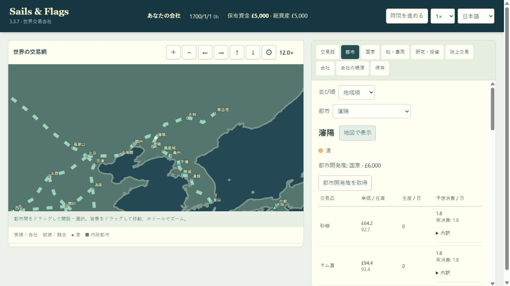

# 北京・満州・朝鮮の都市と陸路

## 変更内容

9内陸都市・11陸路を追加しました。世界283都市（129港・154内陸都市）、48国家、20交易品、314道路スロット（有効296・廃止18）。公開バージョン表記は3.3.7のまま、内部保存版city_versionを16へ更新しています。

| 追加都市 | 所属・必要免許 | 主産品の設定 |
|---|---|---|
| 山海関 | 清 | 食料・工具 |
| 錦州 | 清 | 食料・織物 |
| 瀋陽 | 清 | 織物・工具 |
| 遼陽 | 清 | 食料・織物 |
| 鳳凰城 | 清 | 木材・食料 |
| 義州 | 朝鮮 | 織物・食料 |
| 開城 | 朝鮮 | 織物・工具 |
| 吉林 | 清 | 毛皮・食料 |
| 寧古塔 | 清 | 毛皮・木材 |

東アジアの市場圏と北方内陸の生産適性を適用します。全品目に消費需要を保持し、茶・絹・陶磁器などを一律に現地生産させません。主産品・市場規模はゲーム用の概算で、史実の生産統計を再現したものではありません。

| 新設区間 | 概算距離km | 地形 | 必要免許 |
|---|---:|---|---|
| 北京―山海関 | 350 | 平地 | 清 |
| 山海関―錦州 | 200 | 丘陵 | 清 |
| 錦州―瀋陽 | 280 | 平地 | 清 |
| 瀋陽―遼陽 | 75 | 平地 | 清 |
| 遼陽―鳳凰城 | 230 | 山岳 | 清 |
| 鳳凰城―義州 | 100 | 丘陵 | 清・朝鮮 |
| 義州―平壌 | 220 | 丘陵 | 朝鮮 |
| 平壌―開城 | 180 | 丘陵 | 朝鮮 |
| 開城―漢城 | 80 | 丘陵 | 朝鮮 |
| 瀋陽―吉林 | 470 | 丘陵 | 清 |
| 吉林―寧古塔 | 420 | 山岳 | 清 |

本線は北京―山海関―錦州―瀋陽―遼陽―鳳凰城―義州―平壌―開城―漢城、支線は瀋陽―吉林―寧古塔です。既存の平壌―漢城の直接陸路は廃止しています。往復の巡回設定では「平壌→開城→漢城→開城」のように戻りの中継都市も指定します。

## 地形・表示・保存

- 道路は遼西・遼東・朝鮮の陸地を経由する折れ線です。渡河・小駅は経由点として陸上輸送へ抽象化し、独立した河川交通は導入しません。自由通商を史実どおり再現する機能や歴史イベントも追加しません。
- 全新都市にSantiago de Chile―Valparaísoを基準とした最小表示間隔を適用。地理座標を保持したまま、必要な都市のみ表示位置を調整します。道路の全線分を表示補正後の端点でも陸地判定します。
- src/manchuria-korea-data.jsに新規定義をまとめ、既存都市・道路配列の末尾へ追加します。国家の追加、海上ネットワークの変更、外部ライブラリ・素材の追加はありません。
- 旧city_version=15は274都市・303道路として検証し、新規部分だけを初期化。旧0～14の読み込みも維持します。
- hanseong_pyongyangはretired_since=16として旧インデックスを保存し、開設・表示・投資から除外します。旧セーブで当該区間を含む陸上ルートは全社について解除し、車両を未配置へ戻します。残存積荷の原価、道路権の取得原価と投資待機資金を返金します。整備・警備・日額投資設定は消去し、二重返金や現行セーブでの復活を拒否します。
- 停車順・取引条件の変更を伴うため、旧直通ルートから開城経由への自動付け替えは行いません。

## 検証記録

- Wasm再ビルド成功。全新都市の表示間隔と陸地性、全11道路の往復形状・全線分の陸地性を確認。
- 新規4テスト成功：都市・地形、旧直通路の開設/投資/不正復活拒否、旧15の車両保全と一度だけの返金、新区間の運行。
- 全11新区間と開城経由の往復ルートを744日運行し、12ルートすべてで配送成立。国境免許、道路整備、競合50ルート上限、セーブ完全一致再読込を確認。
- 旧直通ルートの待機・積込・移動・荷降ろしの4状態をプレイヤー/競合に作り、車両名・種類・台数、無関係なルート・市場・開発・乱数を保全。残存積荷原価と道路資産だけを返金し、再読込で増額されないことを確認。
- 3.3.7の実Wasm（HEAD）で直通路と道路投資を作り7日進めた保存を新Wasmで読込。車両1台を保全し、£3,081.09387012636の資産返金と、その後31日進行・完全一致再読込に成功。
- 変更前との比較で旧274都市・48国家・20品目・既存全海路の距離/形状・初期会社配置が一致。旧303道路のうち廃止1件のみ無効化・描画点除去し、その他302件は完全一致。
- 既存韓国テストの直接陸路への参照を更新。漢城―開城は市場条件により馬車が採算待機するため、配送の回帰テストは平壌―開城を対象とし、漢城―開城も新規のキャラバン運行テストで検証しました。経済ルールは変更していません。
- ブラウザで瀋陽の清所属・開城の朝鮮所属、地図の12倍表示、都市名クリック、鳳凰城―義州の100km・両国免許の要求・免許不足時の開設無効を確認。console警告・エラーなし。日付・資金を変えず、確認後は開城の都市画面へ戻しました。
- 関連66項目の成功を確認（wasm-core 48、manchuria-korea 4、coastal-roads-korea 4、asia-road-revisions 3、silk-road 4、wasm-boundary 3）。初回の63項目では旧韓国テスト2件の期待値更新漏れ/配送対象の不適合を検出し、修正後に当該ファイル全4項目と境界3項目を再実行して7件すべて成功。その他59項目は初回に成功しています。50年運行・帳簿の保持上限・旧会社構成・過去の都市追加保存移行も確認しました。
- 変更JavaScriptの構文、更新テキストの文字化け、git diff --checkに成功。全npmテストの再実行は行わず、今回の保存/道路変更とWasmコアを対象に検証しました。

検証コマンド：

```text
npm run build:wasm
node --test --test-concurrency=2 tests/manchuria-korea.test.js tests/coastal-roads-korea.test.js tests/asia-road-revisions.test.js tests/silk-road.test.js tests/wasm-core.test.js
node --test tests/coastal-roads-korea.test.js tests/wasm-boundary.test.js
git -c core.safecrlf=false diff --check
```



## 都市選定の参考

前の検討で確認した資料に基づくゲーム用の接続です。文章・図版の転載はありません。

- [朝鮮使節の瀋陽経由路に関する研究](https://www.kci.go.kr/kciportal/ci/sereArticleSearch/ciSereArtiView.kci?sereArticleSearchBean.artiId=ART001832467)：清代の使節路と瀋陽経由の根拠。
- [韓国民族文化大百科・義州商人](https://encykorea.aks.ac.kr/Article/E0017619)：対清交易・使節に伴う商業活動。
- [韓国民族文化大百科・開城商人](https://encykorea.aks.ac.kr/Article/E0001656)：国内外交易を担った開城の商人。
- [康熙年間の盛京内務府商人](https://www.qinghistory.cn/c/435/435111.shtml)：盛京・吉林や鳳凰城方面の商業活動。
- [吉林省地方志・吉林と寧古塔の駅路](https://dfz.jl.gov.cn/zsjl/201801/t20180118_5216429.html)：1688年の駅路整備。
- [寧安市・寧古塔](https://www.ningan.gov.cn/nasrmzf/c104744/202301/c03_565616.shtml)：新城の位置と清代の拠点史。
